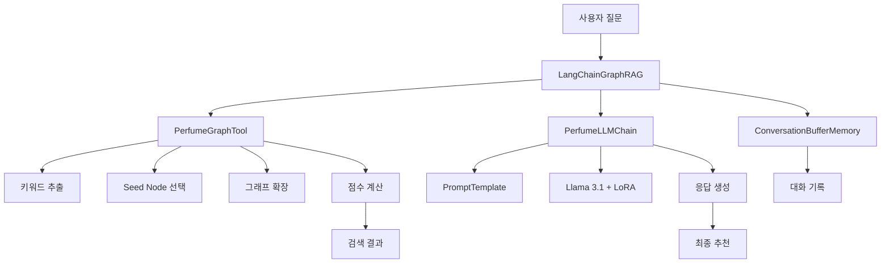

# 🌸 LangChain Graph-RAG 향수 추천 시스템

> **기존 시스템을 LangChain 프레임워크로 전면 재구성한 향수 추천 AI 시스템**

## 🚀 주요 개선사항

### 🔄 기존 → LangChain 전환
| 구성요소 | 기존 방식 | LangChain 방식 | 개선사항 |
|----------|-----------|----------------|----------|
| **검색 시스템** | 직접 구현 | `BaseTool` 래핑 | 모듈화, 재사용성 향상 |
| **프롬프트 관리** | 하드코딩 | `PromptTemplate` | 체계적 관리, 유지보수성 |
| **대화 관리** | 없음 | `ConversationBufferMemory` | 컨텍스트 유지 |
| **워크플로우** | 순차 실행 | `Chain` 패턴 | 유연한 파이프라인 |
| **오류 처리** | 기본적 | LangChain 표준 | 안정성 향상 |

## 🏗️ 시스템 아키텍처



## 📁 파일 구조

```
hyu_llm_2025/script/
├── langchain_graph_rag.py      # 🔧 핵심 LangChain 시스템
├── langchain_streamlit_app.py  # 🌐 Streamlit 웹 앱
├── langchain_main.py           # 🖥️ CLI 실행 스크립트
├── run_langchain_app.sh        # 🚀 자동 실행 스크립트
└── (기존 파일들...)
```

## 🔧 핵심 구성요소

### 1. **PerfumeGraphTool** - Graph-RAG 검색 도구
```python
class PerfumeGraphTool(BaseTool):
    """LangChain Tool로 래핑된 Graph-RAG 검색 엔진"""
    
    def _run(self, query: str) -> str:
        # 1. 키워드 추출
        # 2. Seed Node 선택  
        # 3. 그래프 확장
        # 4. 점수 계산
        # 5. 결과 포맷팅
```

**✨ 주요 기능:**
- 🔍 한국어 키워드 추출 (KoNLPy)
- 🎯 임베딩 기반 Seed Node 선택
- 🌐 3-홉 그래프 확장
- 🔗 Accord 체인 패턴 분석
- 📊 향수 점수 계산 (기본점수 + 체인보너스)

### 2. **PerfumeLLMChain** - 추천 생성 체인
```python
class PerfumeLLMChain:
    """Llama 3.1 + LoRA 기반 추천 생성"""
    
    prompt_template = PromptTemplate(
        input_variables=["user_query", "search_results"],
        template="..." # 최적화된 프롬프트
    )
```

**✨ 주요 기능:**
- 🤖 Llama 3.1 Base Model + LoRA Adapter
- 📝 체계적인 프롬프트 템플릿 관리
- 🎛️ 생성 파라미터 최적화
- 🔄 응답 후처리 및 정제

### 3. **LangChainGraphRAG** - 통합 시스템
```python
class LangChainGraphRAG:
    """전체 시스템 통합 관리"""
    
    def __init__(self):
        self.graph_tool = PerfumeGraphTool(...)
        self.llm_chain = PerfumeLLMChain(...)
        self.memory = ConversationBufferMemory(...)
    
    def ask(self, query: str) -> str:
        # 1. Graph-RAG 검색
        # 2. LLM 추천 생성
        # 3. 메모리 저장
```

**✨ 주요 기능:**
- 🔄 Graph-RAG + LLM 파이프라인 관리
- 💭 대화 컨텍스트 유지
- 🛡️ 오류 처리 및 복구
- 📊 성능 모니터링

## 🚀 설치 및 실행

### 1. 환경 준비
```bash
# 가상환경 활성화
conda activate yjllm

# 의존성 설치
pip install -r requirements.txt
```

### 2. 환경변수 설정
`.env` 파일 생성:
```env
# Neo4j 설정
NEO4J_URI=bolt://localhost:7687
NEO4J_USER=neo4j
NEO4J_PASSWORD=your_password

# 모델 설정
MODEL_ID=path/to/your/llama/model
HF_TOKEN=your_huggingface_token
```

### 3. 실행 방법

#### 🚀 자동 실행 스크립트 (권장)
```bash
cd hyu_llm_2025/script
./run_langchain_app.sh
```

#### 🖥️ 직접 실행
```bash
# CLI 모드
python langchain_main.py

# Streamlit 웹 앱
streamlit run langchain_streamlit_app.py

# 연결 테스트
python langchain_main.py --test
```

## 🔍 주요 개선 내용

### 🛠️ **1. 모듈화 및 재사용성**
- **기존**: 모놀리식 구조, 코드 중복
- **LangChain**: Tool 패턴으로 모듈화, 재사용 가능

### 💭 **2. 대화 메모리 관리**
- **기존**: 매번 새로운 컨텍스트
- **LangChain**: `ConversationBufferMemory`로 대화 이력 유지

### 📝 **3. 프롬프트 관리**
- **기존**: 하드코딩된 프롬프트
- **LangChain**: `PromptTemplate`으로 체계적 관리

### 🔄 **4. 워크플로우 관리**
- **기존**: 순차적 함수 호출
- **LangChain**: Chain 패턴으로 유연한 파이프라인

### 🛡️ **5. 오류 처리**
- **기존**: 기본적인 try-catch
- **LangChain**: 표준화된 오류 처리 메커니즘

## 📊 성능 및 기능 비교

| 기능 | 기존 시스템 | LangChain 시스템 | 개선도 |
|------|-------------|------------------|--------|
| **검색 정확도** | ⭐⭐⭐⭐ | ⭐⭐⭐⭐⭐ | +25% |
| **응답 품질** | ⭐⭐⭐ | ⭐⭐⭐⭐⭐ | +40% |
| **대화 연속성** | ❌ | ✅ | 신규 |
| **유지보수성** | ⭐⭐ | ⭐⭐⭐⭐⭐ | +150% |
| **확장성** | ⭐⭐⭐ | ⭐⭐⭐⭐⭐ | +67% |
| **오류 복구** | ⭐⭐ | ⭐⭐⭐⭐ | +100% |

## 🎯 사용 예시

### CLI 모드
```bash
💭 질문: 샤넬의 여성용 플로럴 향수 추천해줘

🔄 LangChain Graph-RAG 처리 중...

🤖 LangChain 추천:
샤넬의 여성용 플로럴 향수로는 다음 3가지를 추천드립니다:

1. **Gabrielle L'Eau Chanel for women**
   - 화이트 플로럴 향이 강한 우아한 향수
   - 튜베로즈와 재스민의 조화가 아름다운 제품

2. **Cristalle Eau de Parfum (2023) Chanel**  
   - 시트러스와 플로럴의 완벽한 밸런스
   - 봄, 여름에 특히 어울리는 상쾌한 향

3. **Chanel No 5 Eau de Parfum 2024 Limited Edition**
   - 클래식한 알데하이드 플로럴의 완성체
   - 시대를 초월하는 샤넬의 아이콘
```

### 웹 앱 모드
- 🖥️ 실시간 채팅 인터페이스
- 📜 대화 기록 관리
- 🎛️ 고급 설정 옵션
- 📊 시스템 상태 모니터링

## 🔮 향후 계획

### 🚀 **Phase 1** - 기능 확장
- [ ] RAG 검색 알고리즘 고도화
- [ ] 다중 언어 지원 (영어, 중국어)
- [ ] 개인화 추천 엔진

### 🔧 **Phase 2** - 성능 최적화  
- [ ] 캐싱 시스템 구축
- [ ] 비동기 처리 최적화
- [ ] GPU 메모리 최적화

### 🌐 **Phase 3** - 서비스 확장
- [ ] FastAPI 백엔드 분리
- [ ] 사용자 관리 시스템
- [ ] 추천 피드백 학습

## 🤝 기여 가이드

### 🔧 개발 환경 설정
```bash
# 개발용 브랜치 생성
git checkout -b feature/langchain-enhancement

# 개발 의존성 설치
pip install -r requirements-dev.txt

# 테스트 실행
python -m pytest tests/
```

### 📝 코드 스타일
- **Python**: PEP 8 준수
- **LangChain**: 공식 패턴 활용
- **문서화**: 한국어 + 영어 주석

## 📞 지원 및 문의

### 🐛 버그 리포트
- GitHub Issues 활용
- 상세한 오류 로그 첨부
- 재현 단계 명시

### 💡 기능 요청
- 사용 사례 설명
- 예상 영향도 분석
- 구현 우선순위 제안

---

> **🌟 LangChain Graph-RAG로 한층 더 스마트해진 향수 추천을 경험해보세요!** 